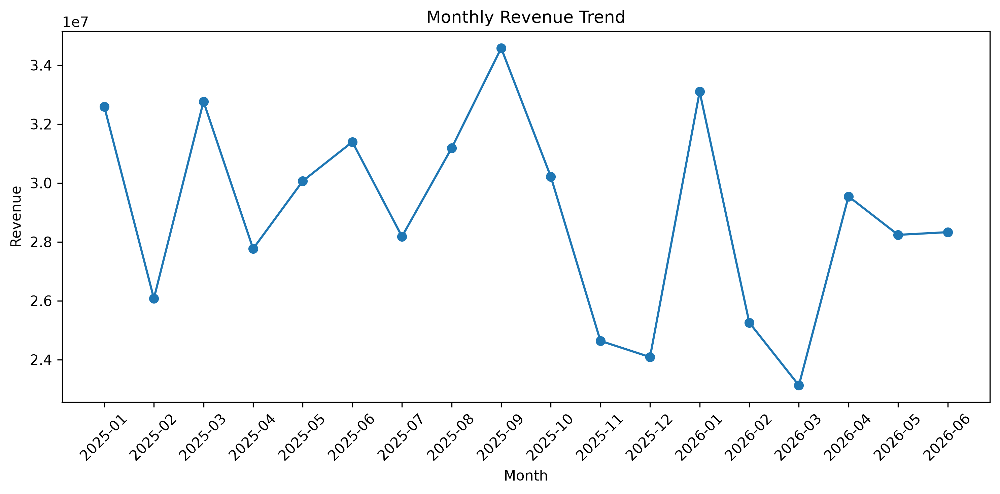
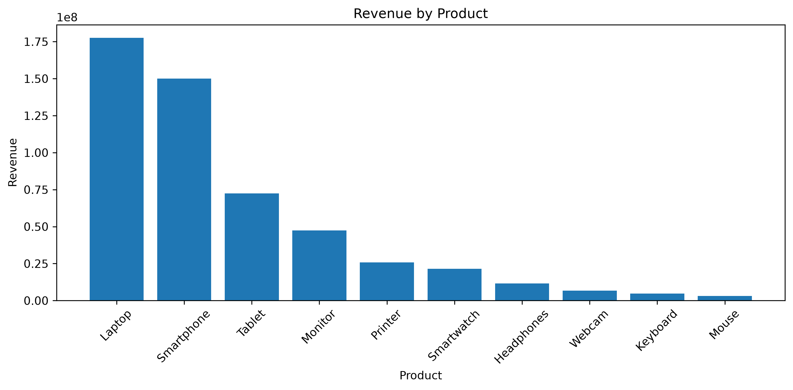
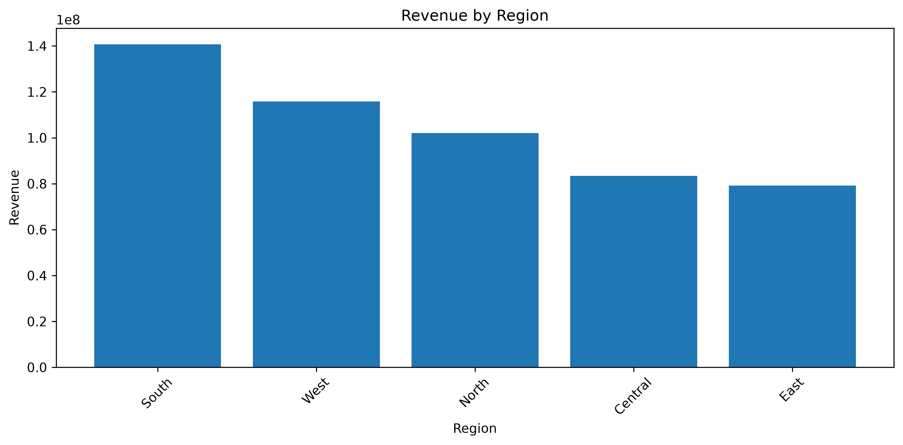

# Real-World Sales Data Analysis with Python

A real-world-style sales data analysis project built using Python, Pandas, NumPy, and Matplotlib.

## 📌 Project Overview

In this project, I analyzed more than 5,000 sales records to understand business performance across products, regions, sales channels, and time.

The project follows a complete data analysis workflow:

**Raw Data → Data Cleaning → Analysis → Statistics → Visualization → Insights**

## 🛠️ Technologies Used

- Python
- Pandas
- NumPy
- Matplotlib

## 📊 Dataset

The dataset contains sales information including:

- Order ID
- Order Date
- Customer ID
- Product
- Category
- Region
- Sales Channel
- Sales Representative
- Units Sold
- Unit Price
- Discount
- Revenue
- Cost
- Profit
- Profit Margin
- Payment Method
- Customer Rating
- Returned

## 🧹 Data Cleaning

Before analyzing the data, I:

- Checked for missing values
- Handled missing categorical values using the mode
- Handled missing numerical values using the median
- Identified duplicate records
- Removed duplicate records
- Verified the cleaned dataset

## 📈 Analysis Performed

The project answers questions such as:

- What is the total revenue?
- What is the average revenue?
- How much profit was generated?
- What is the average profit margin?
- How many units were sold?
- Which product generated the most revenue?
- Which product sold the most units?
- Which region generated the most revenue?
- Which region sold the most units?
- Which sales channel generated the most revenue?
- Which month generated the highest revenue?
- Which month generated the lowest revenue?
- What is the return rate?
- What is the average customer rating?

## 🔢 NumPy Statistics

NumPy was used to calculate:

- Mean
- Median
- Minimum
- Maximum
- Standard deviation
- Difference between mean and median

## 📊 Data Visualizations

Matplotlib was used to create:

- Monthly Revenue Trend
- Revenue by Product
- Revenue by Region

### Monthly Revenue



### Revenue by Product



### Revenue by Region



## 📁 Project Structure

```text
Real-World Data Analysis Project/
│
├── data/
│   ├── monthly_sales_5000_raw.csv
│   └── monthly_sales_5000_cleaned.csv
│
├── charts/
│   ├── Monthly_Revenue.png
│   ├── Revenue_by_Product.png
│   └── Region_Revenue.png
│
├── sales_analysis.py
├── README.md
└── .gitignore